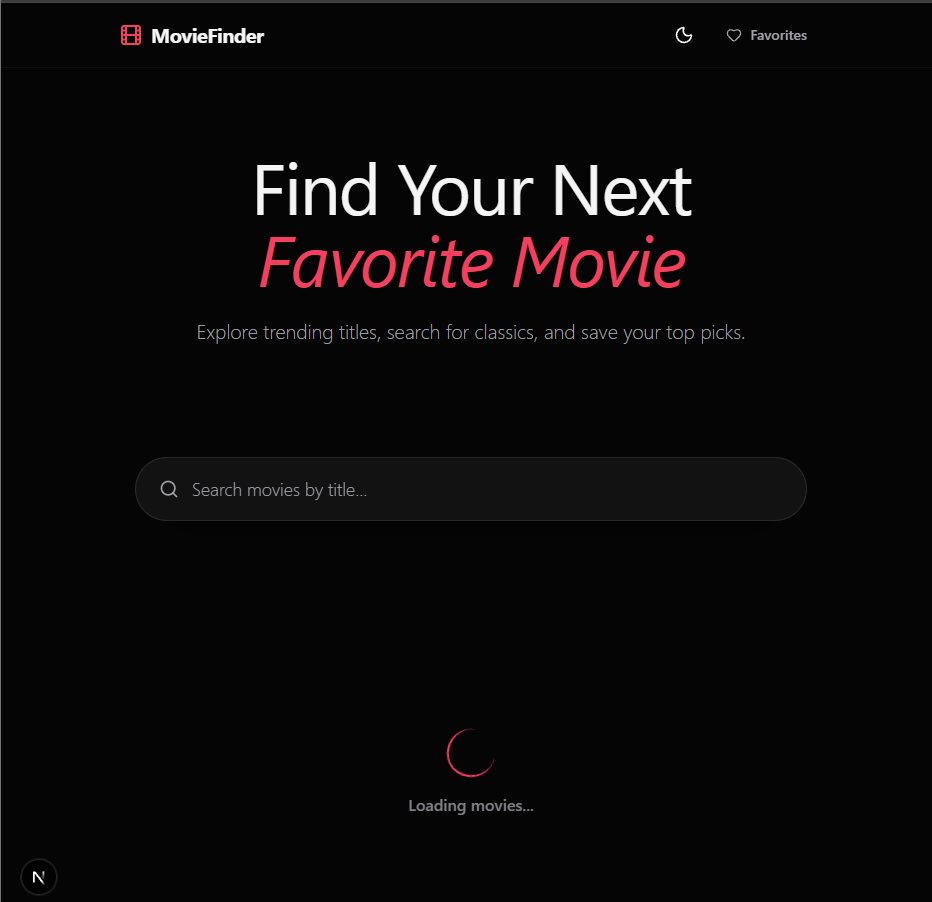
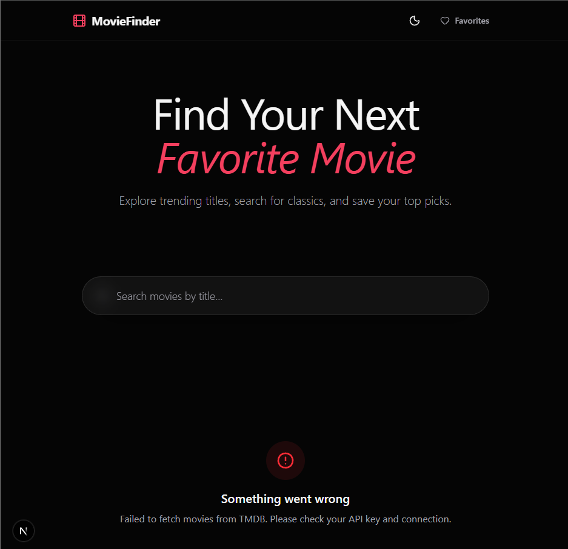

# MovieFinder

A modern, responsive Next.js web application for discovering movies, searching by title, and saving favorites.

## Features
- **Browse & Search**: Explore popular movies or search for specific titles dynamically.
- **Precise Pagination**: Displays exactly 12 items per page using custom TMDB page mapping.
- **Favorites**: Save your top picks locally. Favorites persist across page reloads.
- **Premium Design**: Built with Tailwind CSS v4, Framer Motion, and a curated dark theme.

## Public API Used
This project uses the **TMDB (The Movie Database) API** to fetch live movie data.

### How to get an API Key
1. Go to [themoviedb.org](https://www.themoviedb.org/) and create a free account.
2. Navigate to your Account Settings -> API.
3. Generate a new API Key (v3 auth) or an API Read Access Token (v4 auth).

### Environment Setup
Create a `.env.local` file in the root of the project and add your TMDB key. You can use either the Bearer token or the simple API Key string:

```env
# Using API Read Access Token (Bearer Token format - Recommended)
TMDB_API_KEY="eyJhb...your_token_here"

# OR using the standard v3 API Key
TMDB_API_KEY="your_api_key_here"
```

## Application States & UI Showcases

Here are some previews of the different application states, ensuring a smooth and responsive user experience across devices:

### 1. Mobile Responsive View
The application is fully responsive. The "Midnight Cinema" design adapts perfectly to smaller screens, keeping the search and movie grid highly legible.


### 2. Loading States
During data fetching or pagination, the application uses skeleton loaders to avoid layout shifts and keep the UI feeling fast and responsive.


### 3. Error Handling
If the TMDB API fails or there is a network issue, the application gracefully falls back to an error state with an option to retry, preventing the app from crashing.


## Running Locally

1. **Install dependencies**:
```bash
npm install
```

2. **Run the development server**:
```bash
npm run dev
```

3. Open [http://localhost:3000](http://localhost:3000) in your browser.
